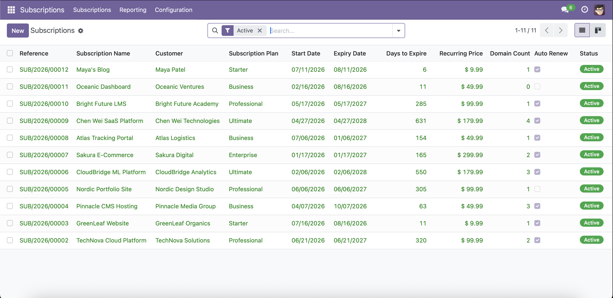

# 📦 Subscription Management — Odoo 17 Module

A full-featured Odoo 17 module for managing customer subscriptions, domains, billing plans, and automated renewals. Built with **Python** and **PostgreSQL**.



---

## ✨ Features

| Feature | Description |
|---------|-------------|
| **Subscription Lifecycle** | Draft → Confirmed → Active → Expiring Soon → Expired → Cancelled |
| **Billing Plans** | 5 plan tiers (Starter to Ultimate) with monthly, quarterly, semi-annual, annual, and biennial cycles |
| **Domain Management** | Track domains per subscription with DNS config, SSL certificates, IP addresses, and registrar info |
| **Auto-Renewal** | Automated renewal via daily cron jobs for subscriptions with auto-renew enabled |
| **Expiry Alerts** | Cron job marks subscriptions as "Expiring Soon" 30 days before expiry with email notifications |
| **Renewal Wizard** | Quick renewal dialog to extend or change plans |
| **Kanban Board** | Visual Kanban view grouped by subscription state with color-coded cards |
| **Reporting** | Pivot tables and bar charts for subscription analytics |
| **Access Control** | Role-based access: User (own subscriptions) vs Manager (all subscriptions) |
| **Chatter & Activities** | Full Odoo mail thread integration for audit trail and activity scheduling |

---

## 🏗️ Architecture

```
subscription_management/
├── __manifest__.py              # Module metadata & dependencies
├── __init__.py
├── models/
│   ├── subscription.py          # Core subscription model + cron jobs
│   ├── subscription_plan.py     # Billing plans (Starter → Ultimate)
│   └── subscription_domain.py   # Domain management with DNS/SSL
├── views/
│   ├── subscription_views.xml   # Tree, Form, Kanban, Search views
│   ├── subscription_plan_views.xml
│   ├── subscription_domain_views.xml
│   └── menu_views.xml           # App menu structure
├── wizard/
│   └── subscription_renew.py    # Renewal wizard
├── security/
│   ├── subscription_security.xml  # Groups & record rules
│   └── ir.model.access.csv       # Model access rights
├── data/
│   ├── sequence_data.xml        # SUB/YYYY/XXXXX numbering
│   ├── cron_data.xml            # Daily expiry check & auto-renew
│   ├── mail_template_data.xml   # Expiry notification email
│   └── demo_data.xml            # Demo plans & tags
├── report/
│   └── subscription_report_views.xml  # Pivot & graph views
├── scripts/
│   └── seed_data.py             # Seed 25 subscriptions, 27 domains, 15 customers
├── docker-compose.yml           # Odoo 17 + PostgreSQL 16
├── odoo.conf                    # Server configuration
└── start.sh                     # One-command setup & seed
```

---

## 📊 Data Models

### `subscription.plan`
| Field | Type | Description |
|-------|------|-------------|
| `name` | Char | Plan name (Starter, Professional, etc.) |
| `code` | Char | Unique code (STARTER, PRO, BIZ, ENT, ULT) |
| `billing_cycle` | Selection | monthly / quarterly / semi_annual / annual / biennial |
| `price` | Float | Recurring price per cycle |
| `max_domains` | Integer | Maximum domains allowed |
| `max_storage_gb` | Float | Storage limit in GB |
| `feature_ssl` | Boolean | SSL certificate included |
| `feature_backup` | Boolean | Auto backup included |
| `feature_support` | Selection | email / priority / dedicated |

### `subscription.subscription`
| Field | Type | Description |
|-------|------|-------------|
| `reference` | Char | Auto-generated (SUB/2026/00001) |
| `partner_id` | Many2one | Customer (res.partner) |
| `plan_id` | Many2one | Linked billing plan |
| `date_start` | Date | Subscription start date |
| `date_end` | Date | Computed expiry date |
| `days_to_expire` | Integer | Computed countdown |
| `state` | Selection | draft / confirm / active / expiring_soon / expired / cancelled |
| `is_auto_renew` | Boolean | Auto-renewal flag |
| `domain_ids` | One2many | Linked domains |

### `subscription.domain`
| Field | Type | Description |
|-------|------|-------------|
| `name` | Char | Domain name (validated format) |
| `is_primary` | Boolean | Primary domain flag (one per subscription) |
| `state` | Selection | pending / propagating / active / inactive / error |
| `dns_provider` | Char | DNS provider (Cloudflare, AWS Route53, etc.) |
| `ip_address` | Char | Server IP address |
| `ssl_enabled` | Boolean | SSL certificate active |
| `ssl_expiry_date` | Date | SSL certificate expiry |
| `registrar` | Char | Domain registrar |

---

## 🚀 Quick Start (Docker)

### Prerequisites
- [Docker](https://docs.docker.com/get-docker/) & Docker Compose
- ~2 GB disk space for images

### One-Command Setup

```bash
git clone https://github.com/ranacode97/subscription-management.git
cd subscription-management
chmod +x start.sh
./start.sh
```

This will:
1. Start **PostgreSQL 16** + **Odoo 17** containers
2. Wait for Odoo to be ready
3. Create the database `odoo_db`
4. Install the `subscription_management` module
5. Seed **25 subscriptions**, **27 domains**, **15 customers**, **5 plans**, **8 tags**

### Access the App

| | |
|---|---|
| **URL** | [http://localhost:8069](http://localhost:8069) |
| **Database** | `odoo_db` |
| **Login** | `admin` |
| **Password** | `admin` |

Navigate to the **Subscriptions** app from the main menu.

### Manual Setup (without start.sh)

```bash
# Start containers
docker compose up -d

# Wait for Odoo, then visit http://localhost:8069
# Create database with master password: admin_master_pwd
# Install module: Apps → Update Apps List → Search "Subscription Management" → Install

# Seed dummy data
docker exec -it odoo_server python3 \
  /mnt/extra-addons/subscription_management/scripts/seed_data.py
```

---

## 🔧 Configuration

### `odoo.conf`

| Setting | Value | Description |
|---------|-------|-------------|
| `admin_passwd` | `admin_master_pwd` | Master password for DB management |
| `db_host` | `db` | PostgreSQL container hostname |
| `addons_path` | `/mnt/extra-addons,...` | Custom addons directory |
| `workers` | `0` | Single-process mode (dev) |

### Docker Ports

| Port | Service |
|------|---------|
| `8069` | Odoo web interface |
| `8072` | Longpolling / live chat |
| `5433` | PostgreSQL (mapped from 5432) |

---

## 📈 Dummy Data Summary

The seed script populates the database with realistic data:

| Entity | Count | Details |
|--------|-------|---------|
| **Plans** | 5 | Starter ($9.99/mo) → Ultimate ($179.99/2yr) |
| **Tags** | 8 | VIP, Trial, Reseller, Agency, Non-Profit, Government, Education, Startup |
| **Customers** | 15 | Companies and individuals across 10 countries |
| **Subscriptions** | 25 | 3 Draft, 2 Confirmed, 12 Active, 4 Expired, 4 Cancelled |
| **Domains** | 27 | With DNS, SSL, registrar, and nameserver data |

---

## 🛠️ Development

### Stop / Restart

```bash
docker compose down          # Stop and remove containers
docker compose up -d         # Restart
docker compose logs -f odoo  # View Odoo logs
```

### Re-seed Data

```bash
docker exec -it odoo_server python3 \
  /mnt/extra-addons/subscription_management/scripts/seed_data.py
```

The seed script is idempotent — it skips records that already exist.

### Upgrade Module After Code Changes

```bash
docker compose restart odoo
# Or via the UI: Apps → Subscription Management → Upgrade
```

---

## 📝 License

LGPL-3.0

---

## 🙏 Built With

- [Odoo 17](https://www.odoo.com/) — ERP & business application framework
- [PostgreSQL 16](https://www.postgresql.org/) — Relational database
- [Docker](https://www.docker.com/) — Containerization
- Python 3 — Backend logic
